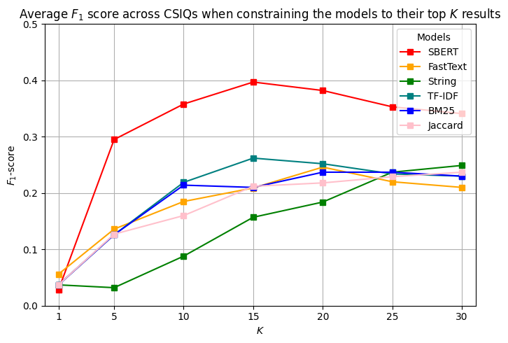

### Advancing Knowledge Discoveries in Criminal Investigations with Semantic Textual Similarity

This repo contains the necessary files to produce the numbers used for the paper.

The folders are organized as:
- kripos
    - 3 steps for creating the embeddings and index to apply semantic search operations on the data.
    - As data is strictly confidential, we cannot share the data used for the experiments. However, we supply a dataset of 100 court decisions from Lovdata.
- lovdata
    - 3 steps, similar to above, to reproduce the stats and figure in the paper.
- models
    - helpers for various models tested throughout the work.
    

# Examples and results

| Query for CSIQ | $N_{tot}$ | Model    | $N_{ret}$ | $P$     | $R$     | $F_1$   |
| --------------- | ------- | -------- | ------- | ----- | ----- | ----- |
| CSIQ 1: Who has a connection to the house/residence | 17 | SBERT | 14 | **0.571** | **0.471** | **0.516** |
| | | Fasttext | 16 | 0.375 | 0.353 | 0.364 |
| | | string | 10 | 0.3 | 0.176 | 0.222 |
| | | TF-IDF | 15 | 0.467 | 0.412 | 0.437 |
| | | BM-25 | 15 | 0.400 | 0.353 | 0.375 |
| | | jaccard | 13 | 0.462 | 0.353 | 0.400 |
| CSIQ 2: What has happened - cause of death | 17 | SBERT | 11 | **0.636** | **0.412** | **0.500** |
| | | Fasttext | 13 | 0.462 | 0.353 | 0.400 |
| | | string | 10 | 0.400 | 0.235 | 0.296 |
| | | TF-IDF | 10 | 0.400 | 0.235 | 0.296 |
| | | BM-25 | 10 | 0.400 | 0.235 | 0.296 |
| | | jaccard | 11 | 0.273 | 0.176 | 0.214 |
| CSIQ 3: Was the offended involved in any conflict? | 5 | SBERT | 5 | **0.400** | **0.400** | **0.400** |
| | | Fasttext | 5 | 0 | 0 | 0 |
| | | string | 4 | 0 | 0 | 0 |
| | | TF-IDF | 4 | 0 | 0 | 0 |
| | | BM-25 | 4 | 0 | 0 | 0 |
| | | jaccard | 4 | 0 | 0 | 0 |
| CSIQ 4: What do we know about the weapon? | 5 | SBERT | 5 | **0.400** | **0.400** | **0.400** |
| | | Fasttext | 4 | 0 | 0 | 0 |
| | | string | 0 | 0 | 0 | 0 |
| | | TF-IDF | 0 | 0 | 0 | 0 |
| | | BM-25 | 0 | 0 | 0 | 0 |
| | | jaccard | 0 | 0 | 0 | 0 |

| Data    | CSIQ                                             | String match       | Query SBERT              | Result String | Result SBERT |
| ------- | ----------------------------------------------- | ------------------- | ------------------------ | ------------- | ------------ |
| Lovdata | Who had access to the house?                   | house               | access to the house     | 7             | 25           |
| Lovdata | What is the cause of death?                    | cause of death      | the cause of death      | 9             | 20           |
| Case A  | Who has a black van?                           | black van           | black van               | 21            | >50          |
| Case A  | Has the deceased been involved in any conflict? | conflict with <NAME> | conflict with <NAME>   | 1             | 27           |
| Case B  | Who had access to the weapon?                 | access to weapon    | access to weapon        | 25            | 47           |
| Case B  | What rumors exist about what happened?        | rumors about        | rumors about what happened | 29            | >50          |

